# CI/CD Workflows

Comprehensive reference for GitHub Actions workflows, repo rulesets, environments, approvals, and the release process for `nat-zero`.

## Workflows at a glance

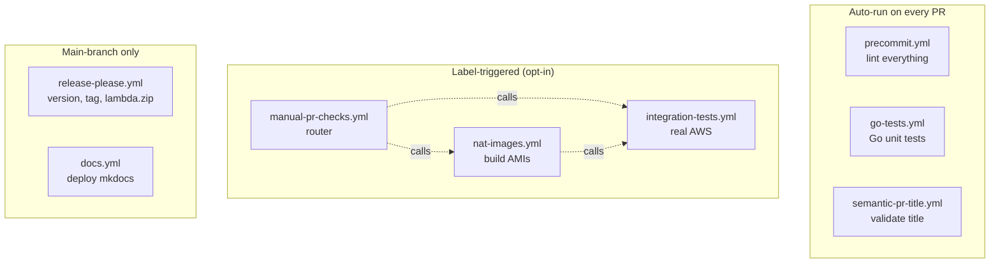

| Workflow | File | Triggers | Required check? |
|----------|------|----------|-----------------|
| Pre-commit | `precommit.yml` | All PRs | Yes (`precommit`) |
| Go Tests | `go-tests.yml` | Every PR + push to `main` (gating job skips `go-test`/`go-dep-check` when no Go-relevant paths changed) | Yes (`go-test`) |
| Semantic PR Title | `semantic-pr-title.yml` | All PRs (`pull_request`) | Yes (`semantic-pr-title`) |
| Manual PR Checks | `manual-pr-checks.yml` | PR labeled `integration-test` or `nat-images` | No (router) |
| Integration Tests | `integration-tests.yml` | Manual dispatch; reusable workflow | No (called via router) |
| NAT Images | `nat-images.yml` | Manual dispatch; reusable workflow | No (promotion workflow) |
| Docs | `docs.yml` | Push to `main` when `docs/**`, `mkdocs.yml`, `.github/workflows/docs.yml`, `README.md`, or `*.tf` change; manual dispatch | No (post-merge deploy) |
| Release Please | `release-please.yml` | Push to `main`; manual dispatch | No (post-merge) |

## Permission and approval matrix

| Workflow | Workflow permissions | AWS role (OIDC) | Environment | Approver |
|---|---|---|---|---|
| `precommit.yml` | `contents: read` | — | — | — |
| `go-tests.yml` | `contents: read` | — | — | — |
| `semantic-pr-title.yml` | `contents: read` | — | — | — |
| `manual-pr-checks.yml` | `contents: write`, `id-token: write`, `issues: write`, `pull-requests: write` (workflow ceiling; each job narrows to its minimum) | — | — | — |
| `integration-tests.yml` | `id-token: write`, `contents: read` | `INTEGRATION_ROLE_ARN` | `integration` | **leonardosul** |
| `nat-images.yml` | `contents: read`, `id-token: write` (per-job escalations) | `AMI_BUILD_ROLE_ARN` | `ami-build` | **leonardosul** |
| `release-please.yml` | top-level `{}`; `release-please` job: `contents: write` + `pull-requests: write`; `build-lambda` job: `contents: write` | — | — | — |
| `docs.yml` | `contents: read`, `pages: write`, `id-token: write` | — | `github-pages` | — |

## Environments

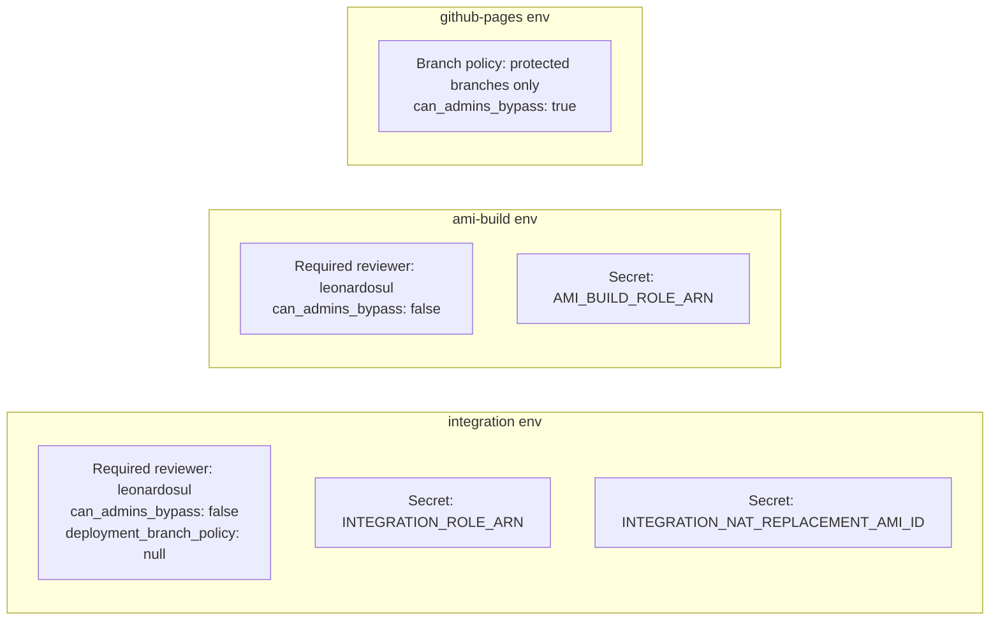

Repo-level variables used by the workflows:

- `NAT_ZERO_TEST_AMI_ID` — default integration test AMI
- `NAT_ZERO_AMI_BUILD_SUBNET_ID` — Packer builder subnet

Repo-level secrets:

- `INTEGRATION_ROLE_ARN` — AWS role assumed for integration tests
- `AMI_BUILD_ROLE_ARN` — AWS role assumed for Packer builds and AMI publishing

## The four PR types

### PR type 1 — Human feature or fix

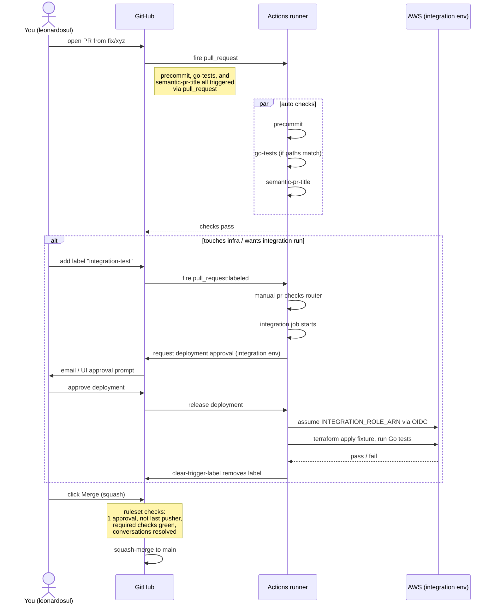

### PR type 2 — Dependabot dependency bump

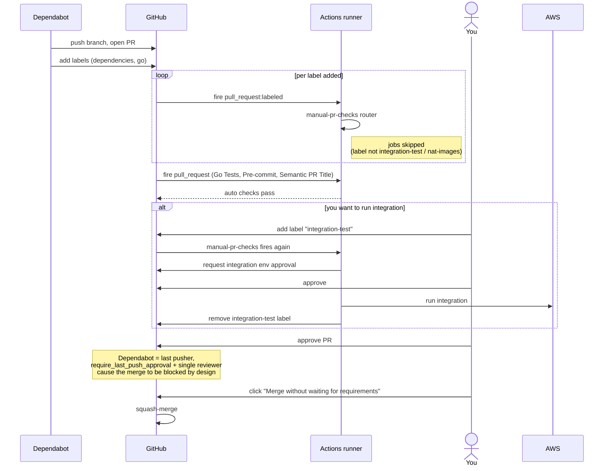

**Why admin bypass is normal here**: `require_last_push_approval: true` plus a single-maintainer repo means Dependabot PRs cannot satisfy the rule through review alone. The ruleset already grants the Admin role `bypass_mode: pull_request`, so the "Merge without waiting for requirements" button is the intended escape hatch. Every use is recorded in the repo audit log.

### PR type 3 — Release-please PR (`chore(main): release X.Y.Z`)

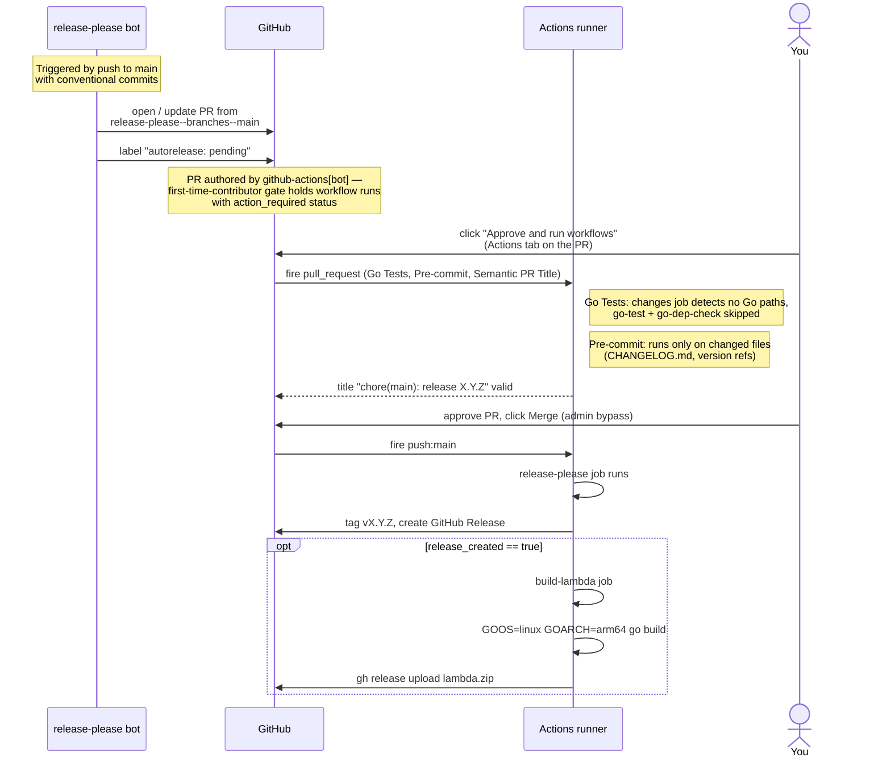

### PR type 4 — AMI promotion PR (`feat: promote nat-zero AMI ...`)

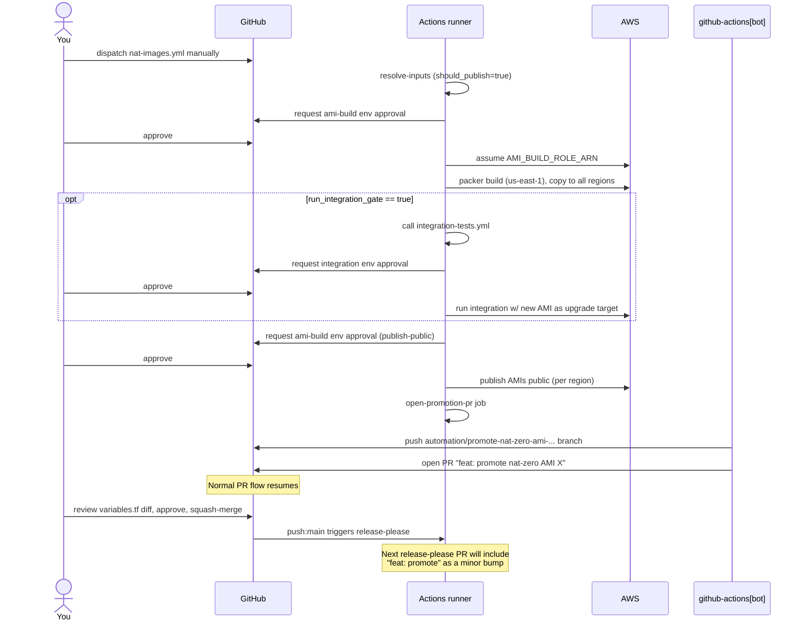

## Decision tree — what runs on any given PR?

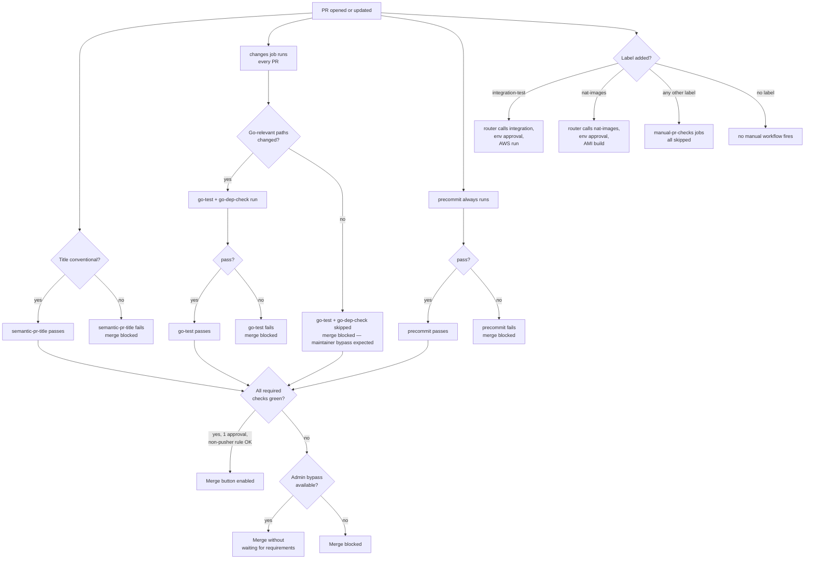

## Workflow details

### Pre-commit (`precommit.yml`)

Runs the repo's `.pre-commit-config.yaml` hooks: `terraform fmt` / `validate`, `tflint`, `terraform-docs`, Go `staticcheck`, `actionlint`, `shellcheck`, and Packer `fmt` / `validate`.

- **Trigger**: all pull requests, no path filter.
- **Required check name**: `precommit`.
- **Scope**: runs hooks only on the files changed between base and head SHA (`pre-commit/action` with `--from-ref` / `--to-ref`).

### Go Tests (`go-tests.yml`)

Three jobs with explicit gating:

1. `changes`: runs on every PR and every push to `main`. Uses `git diff` against the PR base to detect whether any of `cmd/lambda/**`, `tests/integration/**`, or `.github/workflows/go-tests.yml` changed. Exports `outputs.go` as `true` or `false`. On `push: main` it always exports `true`.
2. `go-test`: gated on `needs.changes.outputs.go == 'true'`. Runs `go test -v -race ./...` in `cmd/lambda/` (Lambda unit tests).
3. `go-dep-check`: gated on the same condition. Runs `go build ./...` and `go vet ./...` in `tests/integration/` (dependency health for the test module — catches breakage from Dependabot bumps).

- **PR trigger**: every PR (no path filter).
- **Push trigger**: every push to `main`.
- **Required check name**: `go-test`.
- **Why this design**: we want `go-test` to be a required check, but we do not want to pay the runner cost of the full Go test suite on a docs-only or Terraform-only PR. The gating `changes` job always runs and publishes a `needs.changes.outputs.go` flag; the real work only spins up when that flag says the diff touches Go-relevant paths. This keeps the required-check contract honest: the check exists for every PR, and when it's genuinely not applicable it honestly reports as skipped rather than being faked to success.
- **Reading the rollup**: on a Go-touching PR, `changes`, `go-test`, and `go-dep-check` all run and report success. On a non-Go PR, `changes` reports success and both `go-test` and `go-dep-check` show as skipped — which is the correct signal. The merge will then be blocked by the required-check rule (see the note below) and the maintainer decides whether "skipped" is appropriate for that PR before bypassing.

#### On required checks that can legitimately skip

The `go-test` and `go-dep-check` jobs are required status checks but will report as `SKIPPED` on any PR that does not touch Go code (`cmd/lambda/**`, `tests/integration/**`, or this workflow file). GitHub's ruleset evaluation **treats a skipped required check as unsatisfied**, which means PRs whose Go jobs skip will show `mergeStateStatus: BLOCKED` even when every other check is green.

**This is intentional and not a bug.** The flow is:

1. CI reports honestly — `go-test: SKIPPED` on a docs/TF-only PR.
2. The ruleset correctly refuses to auto-merge a PR with a skipped required check.
3. The maintainer looks at the diff, sees "this is a docs change, of course `go-test` skipped," and uses the admin bypass (`Merge without waiting for requirements`) to merge.
4. Every bypass is recorded in the repo audit log.

If `go-test` skips on a PR that _does_ touch Go code, that is a real red flag — the gating logic is wrong and the workflow change should be investigated before merging. The skip is load-bearing signal, not noise. An always-green "fake success" variant would hide that signal behind a checkmark.

The admin bypass is the intended merge path for legitimately-skipped cases. This is why the ruleset grants the Admin role `bypass_mode: pull_request` — to give a responsible maintainer an explicit, audited override for cases the rule engine cannot reason about on its own.

### Semantic PR Title (`semantic-pr-title.yml`)

Validates that PR titles follow Conventional Commits so squash-merge commit messages stay parseable by release-please.

- **Trigger**: `pull_request` on `opened`, `edited`, `synchronize`, `reopened`.
- **Required check name**: `semantic-pr-title`.
- **Allowed prefixes**: `build`, `chore`, `ci`, `docs`, `feat`, `fix`, `perf`, `refactor`, `revert`, `style`, `test`.
- **Logic**: pure bash regex on `github.event.pull_request.title` — no checkout, no code execution from the PR.
- **Why not `pull_request_target`**: GitHub silently suppresses `pull_request_target` for PRs authored by GitHub App installations (release-please, Dependabot under some configurations). The release-please PRs in this repo's history have zero runs of `semantic-pr-title` for exactly that reason — each one was only mergeable via admin bypass. Using `pull_request` fires for every PR regardless of author, which restores the required-check contract. It is also strictly safer: this workflow only reads the PR title from the event payload (no checkout, no secrets, no API calls), so there is nothing in the elevated `pull_request_target` context that would benefit it, and avoiding `pull_request_target` closes a latent RCE footgun that any future checkout-based edit would open.

### Manual PR Checks (`manual-pr-checks.yml`)

Single router workflow for expensive, manually requested PR checks.

- **Trigger**: `pull_request: types: [labeled]`.
- **Labels**:
  - `integration-test` → calls `integration-tests.yml` as a reusable workflow.
  - `nat-images` → calls `nat-images.yml` as a reusable workflow.
- **Why this exists**: GitHub cannot filter `pull_request:labeled` by label name at the `on:` level. A single router workflow keeps the `if:` complexity in one place.
- **Skipped runs on unrelated labels**: when Dependabot (or you) adds any other label, this workflow fires and all jobs report `skipped`. These runs are free and do not block merges. They are a cosmetic artifact of label-triggered workflows.
- **One-shot behaviour**: the router's `clear-trigger-label` job removes the trigger label after the run is queued, so adding the same label later will trigger a fresh run.

### Integration Tests (`integration-tests.yml`)

Full end-to-end test: deploys real AWS infrastructure via Terratest, exercises the Lambda lifecycle (create NAT, scale-down, restart, cleanup), then destroys everything.

- **Manual trigger**: `workflow_dispatch`.
- **Reusable trigger**: `workflow_call`.
- **Concurrency**: group `nat-zero-integration`, `cancel-in-progress: false`. Only one integration test runs at a time — new runs queue.
- **Environment**: `integration` — holds the `INTEGRATION_ROLE_ARN` secret for OIDC and requires your explicit approval before the job executes.
- **Timeout**: 15 minutes.
- **Required check name (when run via router)**: `integration / integration-test`.
- **Optional inputs**:
  - `nat_ami_id` — force the integration fixture onto a specific NAT AMI. If omitted, the workflow uses `vars.NAT_ZERO_TEST_AMI_ID`.
  - `updated_nat_ami_id` — exercise the AMI replacement path after a second `terraform apply`.

These inputs are test-only fixture controls. Normal module consumers should omit them and use the published nat-zero AMI defaults.

**Steps:**

1. Checkout, setup Go, setup Terraform (wrapper disabled).
2. Assume AWS role via OIDC (`aws-actions/configure-aws-credentials`).
3. Build the Lambda binary from source (`cmd/lambda/` → `.build/lambda.zip`).
4. Run `go test -v -timeout 10m -count=1` in `tests/integration/`.

### NAT Images (`nat-images.yml`)

Manual promotion workflow for the default public nat-zero AMI.

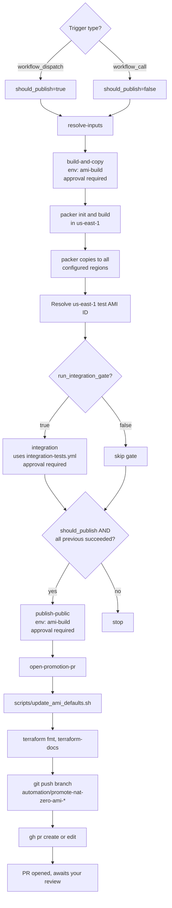

**Stages:**

1. Build the AMI with Packer in the chosen source region.
2. Let Packer privately copy it to the regions listed in `ami/nat-zero-private-all-regions.pkrvars.hcl`.
3. Run one us-east-1 integration gate on a single stack:
   - deploy from the shared private test NAT AMI in `NAT_ZERO_TEST_AMI_ID`
   - exercise the normal NAT lifecycle
   - reapply the module with the new AMI
   - verify the old NAT is replaced and the new NAT works
4. After the integration gate passes, open launch permissions for the copied AMIs (`publish_ami_public.sh`).
5. Open a promotion PR that updates the Terraform defaults (`ami_owner_account`, `ami_name_pattern`) so merge + release-please can publish the new module version.

For pre-merge validation on a branch, add the `nat-images` label to the PR. The router calls `nat-images.yml` as a reusable workflow, which runs the build and integration gates on the PR branch but intentionally skips the public-sharing and promotion-PR jobs (`should_publish=false` on `workflow_call`).

**Approvals per full AMI release**: three — one for `build-and-copy`, one for `integration`, one for `publish-public`.

### Docs (`docs.yml`)

Deploys MkDocs Material to GitHub Pages at <https://nat-zero.machine.dev/>.

- **Trigger**: push to `main` when `docs/**`, `mkdocs.yml`, `.github/workflows/docs.yml`, `README.md`, or `*.tf` change. Also supports `workflow_dispatch` for manual re-deploys.
- **Not a merge gate** — only runs post-merge.
- **How**: two-job pipeline. The `build` job uses `uv` to install dependencies from `pyproject.toml` (dependency group `docs`, pinned via `uv.lock`), runs `mkdocs build` to produce the static site in `site/`, and uploads it as a GitHub Pages artifact. The `deploy` job uses `actions/deploy-pages` to publish the artifact to the `github-pages` environment.
- **Environment**: `github-pages` — deployment branch policy restricts deploys to protected branches only.
- **Concurrency**: group `pages`, `cancel-in-progress: false`.

### Release Please (`release-please.yml`)

Two-job workflow that automates versioning, changelogs, and Lambda binary distribution.

#### Job 1: `release-please`

Runs `googleapis/release-please-action@v4` with:

- **Config**: `release-please-config.json` — `terraform-module` release type at repo root.
- **Manifest**: `.release-please-manifest.json` — tracks the current version.

**How release-please works step by step:**

1. Every push to `main` triggers this job.
2. Release-please scans commits since the last release for Conventional Commits (`feat:`, `fix:`, etc.).
3. If releasable commits exist (`feat` or `fix`), it **creates or updates a release PR** (e.g. `chore(main): release 0.1.0`) containing:
   - Updated `CHANGELOG.md` with grouped entries per the configured sections (Features, Bug Fixes, Performance, Documentation, Miscellaneous).
   - Version bump in `.release-please-manifest.json`.
   - For the `terraform-module` release type, any version strings referenced in Terraform files.
4. The release PR stays open until merged.
5. When the release PR is merged, release-please runs again on that push. It detects its own merged PR and:
   - Creates a **GitHub Release** with a version tag (e.g. `v0.1.0`).
   - Sets output `release_created=true` and `tag_name=v0.1.0`.

#### Job 2: `build-lambda`

Only runs when `release_created == 'true'` (the push that merges a release PR).

1. Cross-compiles the Go Lambda for `linux/arm64`.
2. Creates a deterministic `lambda.zip`.
3. Writes `lambda.zip.base64sha256`, containing the base64-encoded SHA256 for the zip.
4. **Uploads the zip and checksum to the versioned release**.

That is the full release artifact flow. There is no second workflow that edits the release PR, and there is no rolling "latest" Lambda artifact.

#### Changelog sections

| Commit prefix | Changelog section | Triggers release? |
|---------------|-------------------|-------------------|
| `feat:` | Features | Yes (minor bump) |
| `fix:` | Bug Fixes | Yes (patch bump) |
| `perf:` | Performance | No |
| `docs:` | Documentation | No |
| `chore:` | Miscellaneous | No |
| `feat!:` or `BREAKING CHANGE:` | Features | Yes (major bump) |

## Bot-authored PRs and the first-time-contributor gate

GitHub's Actions settings include an approval gate for workflow runs on PRs from "first-time contributors" (outside the repo's collaborator list). This setting applies not just to forks but also to PRs authored by GitHub Apps that do not hold a persistent collaborator role — which includes `github-actions[bot]` (release-please) and, under some configurations, Dependabot.

When the gate fires, the relevant workflow runs sit with conclusion `action_required` until a maintainer clicks **Approve and run workflows** on the PR's Actions tab. No checks complete until then, so required-status-check evaluation is stuck too.

**This is a deliberate safety feature, not a misconfiguration.** Loosening it to "approval only for first-time contributors who are new to GitHub" (the least strict option) means any random GitHub user's first PR to the repo auto-runs workflows. For a public infra module with real users, that is too permissive. The operational cost is low: release PRs arrive once every week or two, and the click is immediate.

The gate configuration lives at **Settings → Actions → General → Fork pull request workflows from outside collaborators**. It is **not** exposed in the REST or GraphQL APIs as a separate setting you can audit programmatically; the signature is `conclusion: action_required` on runs whose `triggering_actor` is `github-actions[bot]`.

### Separately: `pull_request_target` suppression for GitHub Apps

Independent of the first-time-contributor gate, GitHub silently suppresses the `pull_request_target` event for PRs authored by GitHub App installations. This means any workflow that uses `pull_request_target` (and only that trigger) **never runs for release-please or Dependabot PRs**, regardless of whether you approve the first-time-contributor gate.

This is why `semantic-pr-title.yml` was switched from `pull_request_target` to `pull_request` — the previous trigger meant release PRs accumulated with a permanently-missing required check.

### What to expect on release-please PRs

1. PR appears, authored by `github-actions[bot]`.
2. Workflow runs sit with `action_required`. The rollup shows no completed checks.
3. You click **Approve and run workflows** once.
4. All PR workflows execute: `Go Tests`, `Pre-commit`, `Semantic PR Title`.
5. `Go Tests` runs the `changes` gating job and then skips `go-test` + `go-dep-check` because release PRs don't touch Go paths. `Pre-commit` runs against the CHANGELOG + version diffs. `Semantic PR Title` validates the title.
6. Because `go-test` (a required check) reported `SKIPPED`, and because the release PR has no non-bot approval to satisfy `require_last_push_approval`, the PR shows `mergeStateStatus: BLOCKED`.
7. You review the diff (version bump + changelog only) and merge via **Merge without waiting for requirements**. The admin-bypass path described in the [ruleset](#main-branch-ruleset) is the intended merge mechanic for this PR type.

Each release PR therefore requires **two explicit maintainer actions**: one to unlock the workflows, one to merge past the required-check + approval gates. Both are audited. This is the cost of keeping the first-time-contributor gate strict and keeping the required-check contract honest.

## The integration-tests fan-in

`integration-tests.yml` is called three ways. Each path provides different AMI inputs:

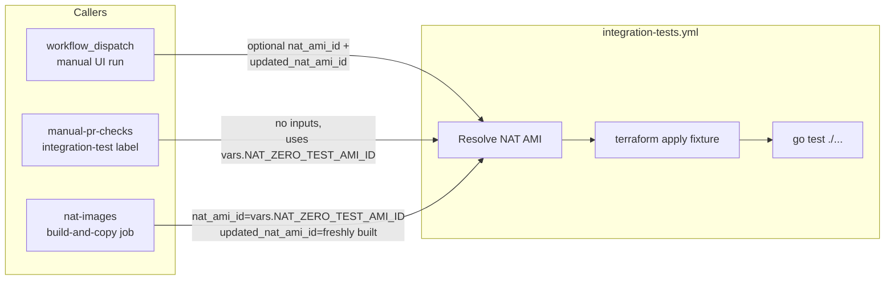

## Secrets and variable flow

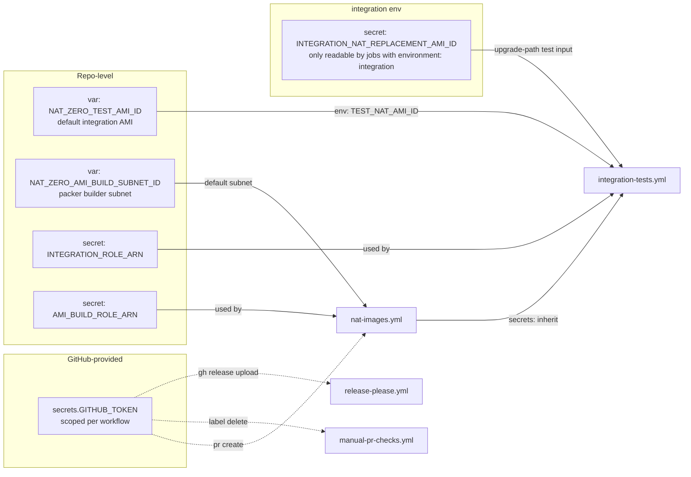

`secrets: inherit` in `manual-pr-checks.yml` and `nat-images.yml` is what lets called workflows see `INTEGRATION_ROLE_ARN` and `AMI_BUILD_ROLE_ARN`. Without it, `workflow_call` invocations would need every secret listed by name.

## Branch protection and rulesets

### `main` branch ruleset

- **Pull requests required** with:
  - **1 required approval from a code owner** — the `CODEOWNERS` file (`* @leonardosul`) means only the repo owner's approval satisfies this requirement. Reviews from non-code-owners are visible but do not count toward the required approval.
  - **Stale reviews dismissed on push**
  - **`require_last_push_approval: true`** — the last pusher cannot count as an approver of their own push. In a solo-maintained repo with Dependabot PRs this means admin bypass is often the expected merge path.
  - **All review threads must be resolved**
  - **Allowed merge method**: squash only
- **Required status checks**: `precommit`, `go-test`, `semantic-pr-title` (strict mode disabled, so PRs do not need to be rebased onto `main` before merge).
- **Linear history required**
- **No force push**
- **No branch creation or deletion**
- **Bypass**: the Admin role has `bypass_mode: pull_request`. Admins can merge PRs that don't meet the requirements via the "Merge without waiting for requirements" option in the merge UI, but cannot push directly to `main`.

### `tags` ruleset

- Protects `refs/tags/v*` — no deletion or update of version tags.
- Ensures release-please's tags are immutable once created.
- Tag **creation** is intentionally unrestricted. Release-please creates tags via the GitHub API using the `GITHUB_TOKEN`, which does not have an admin repository role — a `creation` rule would block it even with the admin bypass, because the bypass only applies to actors with the Admin role, not to the `GITHUB_TOKEN` used by workflows.
- Admin role has `bypass_mode: always` (needed for emergency tag management).

### Actions permissions

Repo-level Actions settings that back the workflow security model:

- **Allowed actions**: the `selected` allowlist permits only GitHub-owned actions plus the publisher patterns `hashicorp/*`, `aws-actions/*`, `googleapis/*`, `pre-commit/*`, and `astral-sh/*`. Any new third-party action outside these patterns is blocked at run time.
- **SHA-pinned references** (convention): every `uses:` reference in this repo's workflow files pins to a full-length commit SHA (e.g. `actions/checkout@34e114...f8d5 # v4`). This closes the "supply-chain tag moves" attack where an upstream action author silently retags to malicious code. The repo-wide `sha_pinning_required` enforcement setting is **not** enabled — it rejects transitive action references inside composite actions (e.g. `pre-commit/action` uses `actions/cache@v4` internally, and the enforcement check blocks the whole workflow). Pinning is maintained by convention, not by the repo-level toggle.
- **Default workflow permissions**: `read` — any workflow that needs write permissions must declare them explicitly at the workflow or job level.
- **`can_approve_pull_request_reviews: true`** for the default `GITHUB_TOKEN`: workflows can create and approve PRs. This is required by release-please (creates release PRs) and `nat-images.yml` (creates promotion PRs). The setting controls both creation and approval despite the name. Code owner review requirements prevent self-approval from satisfying merge gates.

### Merge decision flow

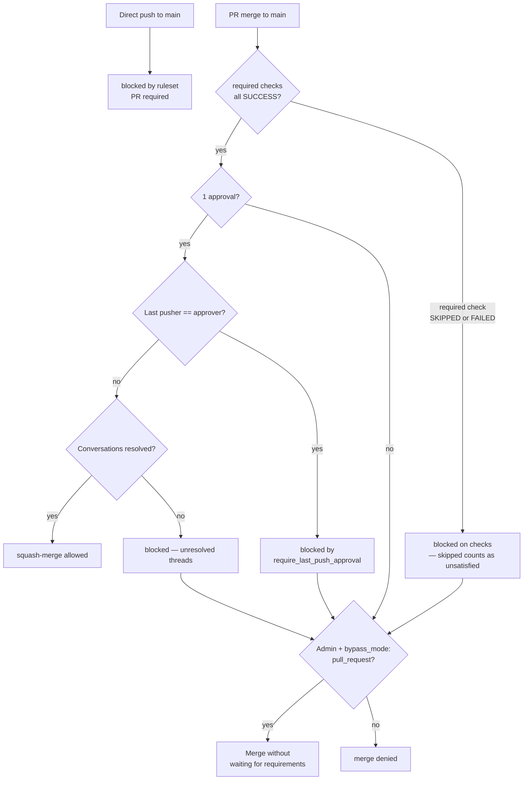

Note: a `SKIPPED` required check is treated as unsatisfied by the ruleset, not as success. This is by design — see the [on-required-checks-that-can-legitimately-skip](#on-required-checks-that-can-legitimately-skip) note above. When `go-test` is skipped because the PR doesn't touch Go code, the bypass is the intended merge path and the maintainer is the final judge of whether the skip was appropriate.

## Lifecycle of a NAT AMI

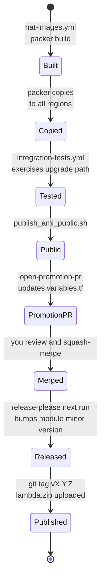

## PR lifecycle summary

```text
Open PR
  -> precommit runs (always)
  -> changes gating job runs (always); go-test + go-dep-check run only when Go paths changed, skipped otherwise
  -> semantic-pr-title runs (always)
  -> Add "integration-test" label -> router calls integration tests
  -> Add "nat-images" label -> router calls the NAT image build / integration gate
  -> threads resolved
  -> 1 approval
  -> Squash merge to main, OR admin bypass when:
       - require_last_push_approval blocks (solo maintainer, Dependabot PRs), or
       - a required check (e.g. go-test) skipped because it was not applicable

Post-merge to main:
  -> release-please creates / updates a release PR (if feat/fix commits exist)
  -> docs deploy (if docs, mkdocs.yml, docs workflow, README.md, or *.tf changed)

Merge release PR:
  -> release-please creates GitHub Release + tag
  -> build-lambda uploads lambda.zip + lambda.zip.base64sha256 to that versioned release
```

## Lambda code paths

The module intentionally supports exactly three ways to supply Lambda code:

1. **Default release artifact**
   - Best for normal users.
   - Terraform downloads the versioned `lambda.zip` and reads the matching `lambda.zip.base64sha256`.
   - The checksum file lets Terraform know `source_code_hash` during `plan`, before the zip is downloaded during `apply`.
   - A changed published checksum shows up as a Lambda code change in `terraform plan`.
2. **Pre-built local zip via `lambda_binary_path`**
   - Best for CI, branch testing, or custom unreleased binaries.
   - Terraform hashes the local file during plan.
3. **Apply-time build via `build_lambda_locally = true`**
   - Best for local development only.
   - Requires Go and `zip`.
   - May require a second apply after Lambda code changes.

## Known gaps

- No auto-merge for Dependabot bumps — every PR requires manual approval and bypass. Intentional: bumps must be eyeballed so the maintainer can decide whether to label for integration testing.
- No scheduled integration tests — only on label or AMI release.
- No CodeQL / SAST.
- No container or AMI vulnerability scanning beyond the pre-commit secret scan.
- No `terraform plan` preview on PRs.
- No `packer validate` check on PRs that only touch `ami/**`.
- No `deployment_branch_policy` on `integration` or `ami-build` environments. The policy would need to allow any PR branch (because label-triggered integration runs target arbitrary PR branches), which reduces the restriction to a wildcard that adds no real protection. Approval remains the sole meaningful gate on environment deployments.
- `integration-tests.yml` concurrency uses `cancel-in-progress: false`. Cancelling a run mid-`terraform apply` can leak real AWS resources (NAT instances, EIPs, ENIs) that a teardown step was about to destroy. Letting queued runs wait is cheaper than cleaning up leaks.
